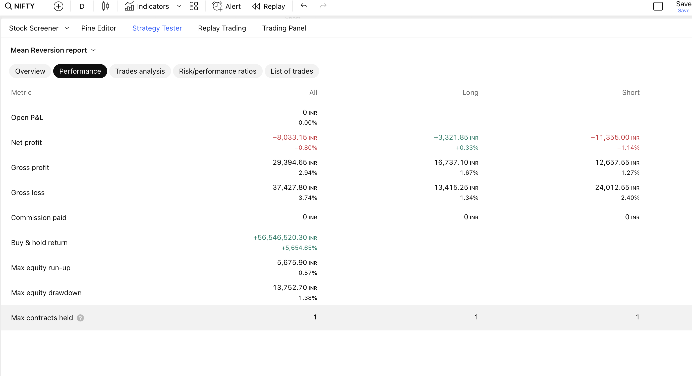
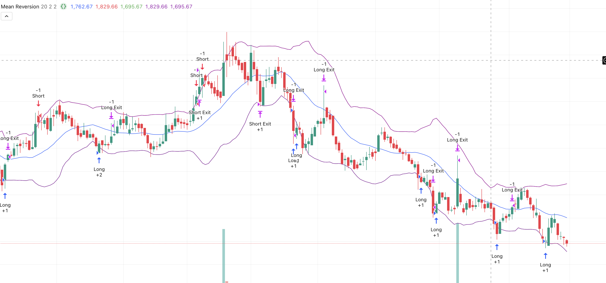

# Mean Reversion Trading Strategy (Pine Script)

This repo contains a mean reversion trading strategy implemented in TradingView's Pine Script (v6). It uses moving averages and standard deviations to identify overbought and oversold conditions based on Z-score.

## Strategy Overview

- Calculates a simple moving average (SMA) and standard deviation over a configurable period.
- Enters a long position when price is significantly below the moving average (z-score < -threshold).
- Enters a short position when price is significantly above the moving average (z-score > threshold).
- Uses dynamic stop loss and take profit based on standard deviation multiples.
- Designed for intraday or swing trading.

## Usage

1. Copy the `main.pine` script.
2. Open TradingView, create a new Pine Script strategy.
3. Paste the code and add it to the chart.
4. Adjust input parameters as needed.

## Backtest Results

## Screenshots

## License

This project is licensed under the GNU General Public License v3.0.

---

## Notes

- This is a basic educational example.
- Use at your own risk and test thoroughly before live trading.
